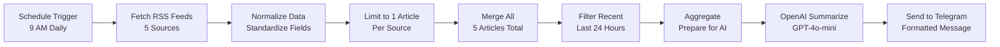

# 🔥 Tech News Daily Digest - n8n Automation

> Automated daily tech news digest powered by RSS feeds, OpenAI, and Telegram


## 📖 Table of Contents

- [Overview](#overview)
- [Features](#features)
- [How It Works](#how-it-works)
- [Prerequisites](#prerequisites)
- [Installation](#installation)
- [Configuration](#configuration)
- [Usage](#usage)
- [Customization](#customization)
- [Troubleshooting](#troubleshooting)
- [Cost Breakdown](#cost-breakdown)
- [Contributing](#contributing)
- [License](#license)
- [Acknowledgments](#acknowledgments)

## 🎯 Overview

This n8n workflow automatically collects tech news from 5 trusted RSS sources, uses AI to create concise summaries, and delivers them directly to your Telegram every morning. Stay updated on the latest tech developments without the information overload!

### What You Get

- **1 article from each major tech publication** (TechCrunch, The Verge, Ars Technica, Wired, MIT Tech Review)
- **AI-powered summary** highlighting the most important story + quick takes on others
- **Delivered to Telegram** every morning at 9 AM (customizable)
- **Zero manual work** - completely automated

## ✨ Features

- 🔄 **Automated Daily Execution** - Runs on schedule, no manual intervention
- 📰 **5 Trusted Tech Sources** - Diverse coverage from major publications
- 🤖 **AI-Powered Summarization** - OpenAI GPT-4o-mini creates concise, engaging summaries
- 📱 **Telegram Delivery** - Clean, mobile-friendly format
- ⚡ **Smart Article Selection** - Gets exactly 1 article from each source for balanced coverage
- 🔍 **Date Filtering** - Only includes articles from the last 24 hours
- 🛡️ **Error Handling** - Continues even if one RSS feed fails
- 💰 **Cost-Effective** - Less than $1/month in API costs

## 🔄 How It Works



### Data Flow

1. **Schedule Trigger** fires at 9 AM daily
2. **5 RSS nodes** fetch articles in parallel from:
   - TechCrunch (1 article)
   - The Verge (1 article)
   - Ars Technica (1 article)
   - Wired (1 article)
   - MIT Technology Review (1 article)
3. **Normalize nodes** standardize field names across different RSS formats
4. **Merge node** combines all 5 articles into one list
5. **Filter node** removes articles older than 24 hours
6. **Aggregate node** prepares data for AI processing
7. **OpenAI node** generates concise summary with top story + key highlights
8. **Telegram node** sends formatted message to your phone

## 📋 Prerequisites

Before you begin, ensure you have:

- [ ] **n8n instance** (self-hosted or cloud)
- [ ] **Telegram account**
- [ ] **OpenAI API key** (with credits)
- [ ] **Basic knowledge** of n8n workflows

### Software Versions

- n8n: v1.0.0 or higher
- Node.js: v18.0.0 or higher (if self-hosting)

## 🚀 Installation

### Step 1: Clone This Repository

```bash
git clone https://github.com/yourusername/tech-news-digest-n8n.git
cd tech-news-digest-n8n
```

### Step 2: Import Workflow to n8n

1. Open your n8n instance
2. Click **"Workflows"** → **"Import from File"** or **"Import from JSON"**
3. Select the `tech-news-workflow.json` file
4. Click **"Import"**

### Step 3: Install Required Nodes

This workflow uses standard n8n nodes. Ensure you have:

- ✅ `n8n-nodes-base.rssFeedRead`
- ✅ `n8n-nodes-base.set`
- ✅ `n8n-nodes-base.merge`
- ✅ `n8n-nodes-base.filter`
- ✅ `n8n-nodes-base.limit`
- ✅ `n8n-nodes-base.aggregate`
- ✅ `@n8n/n8n-nodes-langchain.openAi`
- ✅ `n8n-nodes-base.telegram`

All nodes should be available by default in n8n v1.0.0+

## ⚙️ Configuration

### 1. Get Your Telegram Chat ID

1. Open Telegram
2. Search for `@get_id_bot`
3. Start a chat and send any message
4. **Copy your Chat ID** (e.g., `123456789`)

### 2. Create a Telegram Bot

1. Search for `@BotFather` on Telegram
2. Send `/newbot`
3. Follow the prompts to name your bot
4. **Copy the Bot Token** (format: `1234567890:ABCdefGHI...`)

### 3. Add Telegram Credentials in n8n

1. Go to **Settings** → **Credentials**
2. Click **"Add Credential"**
3. Select **"Telegram API"**
4. Paste your Bot Token
5. Name it (e.g., "Tech News Bot")
6. Click **"Save"**

### 4. Get OpenAI API Key

1. Visit [OpenAI Platform](https://platform.openai.com/api-keys)
2. Sign in or create an account
3. Click **"Create new secret key"**
4. **Copy the API key** (starts with `sk-...`)
5. Add credits to your account (minimum $5)

### 5. Add OpenAI Credentials in n8n

1. Go to **Settings** → **Credentials**
2. Click **"Add Credential"**
3. Select **"OpenAI API"**
4. Paste your API key
5. Name it (e.g., "OpenAI GPT-4o-mini")
6. Click **"Save"**

### 6. Configure the Workflow

#### In the "Send to Telegram" node:
1. Click on the node
2. Set **Chat ID**: `YOUR_TELEGRAM_CHAT_ID` (from Step 1)
3. Select your Telegram credentials (from Step 3)
4. Save the node

#### In the "OpenAI Summarize" node:
1. Click on the node
2. Select your OpenAI credentials (from Step 5)
3. Verify **Model**: `gpt-4o-mini`
4. Verify **Max Tokens**: `800`
5. Verify **Temperature**: `0.7`
6. Save the node

### 7. Set Your Schedule

In the **"Schedule Trigger"** node:
1. Default is **9 AM daily**
2. To change: Click node → Modify `triggerAtHour` (0-23)
3. For multiple times: Use array `[6, 12, 18]` for 6 AM, 12 PM, 6 PM

## 🎮 Usage

### First Run (Test)

1. Open the workflow in n8n
2. Click **"Execute Workflow"** button
3. Wait 30-60 seconds for completion
4. Check your Telegram for the news digest!

### Activate Automatic Execution

1. Toggle the **"Active"** switch at the top right
2. The workflow will now run automatically every day at 9 AM
3. You'll receive your tech news digest without any action needed!

### Manual Execution

To get an update anytime:
1. Go to your workflow in n8n
2. Click **"Execute Workflow"**
3. Wait for completion
4. Check Telegram

## 🎨 Customization

### Change Number of Articles

To get more or fewer articles per source:

1. In each **RSS node** (TechCrunch, Verge, etc.)
2. Find `options.maxItems`
3. Change from `1` to desired number (e.g., `2`, `3`)
4. Update the **AI prompt** to reflect new count

### Add More RSS Sources

To add another tech news source:

1. **Add RSS Read Node**
   - Click **"Add Node"**
   - Search for "RSS Feed Read"
   - Set URL (e.g., `https://www.engadget.com/rss.xml`)
   - Set `options.maxItems` to `1`

2. **Add Normalize Node**
   - Add **"Set"** node after RSS
   - Configure fields: `title`, `pubDate`, `content`, `link`

3. **Update Merge Node**
   - Change `numberInputs` from `5` to `6`
   - Connect new normalize node

4. **Update AI Prompt**
   - Change "These 5 articles" to "These 6 articles"

### Customize Summary Format

In the **"OpenAI Summarize"** node, modify the prompt:

```
You're a tech news editor. These 5 articles just dropped. Give me the TL;DR that matters:

[Articles data here]

Format:
🔥 TOP STORY: [Your custom format]
📱 OTHER KEY NEWS: [Your custom format]
🔗 LINKS: [Your custom format]

Keep it sharp, skip the fluff. Total: ~400 words max.
```

**Popular customizations:**
- Add emojis for each category
- Change word limit (e.g., `~200 words max`)
- Add sentiment analysis
- Include company names mentioned
- Add "Why it matters" section

### Change Delivery Channel

#### Send to Email Instead:
1. Replace **Telegram node** with **Send Email node**
2. Configure SMTP settings
3. Format message as HTML

#### Send to Slack Instead:
1. Replace **Telegram node** with **Slack node**
2. Configure Slack webhook
3. Adjust formatting for Slack markdown

#### Send to Multiple Channels:
1. Add multiple output nodes after OpenAI
2. Each can have different formatting

### Adjust Schedule

#### Multiple Times Per Day:
```json
{
  "rule": {
    "interval": [
      {
        "triggerAtHour": 6
      },
      {
        "triggerAtHour": 18
      }
    ]
  }
}
```

#### Weekdays Only:
```json
{
  "rule": {
    "interval": [
      {
        "triggerAtHour": 9,
        "triggerAtDay": [1, 2, 3, 4, 5]
      }
    ]
  }
}
```

#### Every 6 Hours:
```json
{
  "rule": {
    "interval": [
      {
        "field": "hours",
        "hoursInterval": 6
      }
    ]
  }
}
```

## 🐛 Troubleshooting

### Issue: No Articles Received

**Symptoms:** Workflow completes but no Telegram message

**Possible Causes:**
1. No articles published in last 24 hours
2. All RSS feeds failed
3. Telegram bot not configured

**Solutions:**
- Check **Filter node** output - are there any items?
- Temporarily disable the Filter node to test
- Verify RSS feeds are accessible in a browser
- Check Telegram credentials are correct

### Issue: "Cannot read property 'title' of undefined"

**Symptoms:** Error in OpenAI or Telegram node

**Possible Causes:**
1. Less than 5 articles in aggregate
2. Field mapping issue in normalize nodes

**Solutions:**
- Check **Aggregate node** output structure
- Verify each RSS node has `maxItems: 1`
- Check normalize nodes have all required fields

### Issue: OpenAI API Error

**Symptoms:** "Insufficient credits" or "Invalid API key"

**Solutions:**
- Verify API key is correct
- Check OpenAI account has credits
- Confirm you're using `gpt-4o-mini` model
- Try reducing `maxTokens` if hitting limits

### Issue: Telegram Not Sending

**Symptoms:** Workflow completes but no Telegram message

**Solutions:**
- Verify Chat ID is correct (no quotes in n8n)
- Ensure you've started a conversation with your bot
- Check bot token is valid
- Test credentials with a simple message
- Verify `parse_mode` is set to `Markdown`

### Issue: Summaries Too Long/Short

**Solutions:**
- Adjust `maxTokens` in OpenAI node
- Modify word limit in prompt
- Change `temperature` for more/less verbose output

### Issue: RSS Feed Fails

**Symptoms:** "ENOTFOUND" or "404 Not Found"

**Solutions:**
- Verify RSS URL is correct
- Check if feed is still active
- Try different RSS feed from same source
- Enable `continueRegularOutput` on RSS node (already enabled)

### Issue: Execution Timeout

**Symptoms:** Workflow stops mid-execution

**Solutions:**
- Increase workflow timeout in settings
- Reduce number of RSS sources
- Use faster OpenAI model

## 💰 Cost Breakdown

### Monthly Operating Costs

| Service | Cost | Notes |
|---------|------|-------|
| **n8n Cloud** | $20/month | OR $0 if self-hosted |
| **n8n Self-Hosted** | $5/month | VPS costs (optional) |
| **OpenAI API** | $0.50-1.00/month | GPT-4o-mini for daily summaries |
| **Telegram** | $0 | Completely free |
| **RSS Feeds** | $0 | Free to access |
| **TOTAL** | **$0.50-21/month** | Depends on hosting choice |

### Cost Optimization

**Lowest Cost Setup ($0.50-5/month):**
- Self-host n8n on a $5 VPS (DigitalOcean, Linode, etc.)
- Use GPT-4o-mini for summaries
- Total: ~$5.50/month

**No-Hassle Setup ($20-21/month):**
- Use n8n Cloud ($20/month)
- Use GPT-4o-mini for summaries
- Total: ~$21/month

### OpenAI Token Usage

**Per Execution:**
- Input: ~2,000 tokens (5 articles)
- Output: ~500 tokens (summary)
- Cost per execution: ~$0.002

**Monthly (30 days):**
- 30 executions × $0.002 = **$0.06/month**
- With buffer: **$0.50/month**

### Alternative: Use Free AI Models

Replace OpenAI with:
- **Groq** (free, fast inference)
- **Ollama** (local, completely free)
- **Google Gemini** (has free tier)

## 🤝 Contributing

Contributions are welcome! Here's how you can help:

1. **Fork the repository**
2. **Create a feature branch** (`git checkout -b feature/AmazingFeature`)
3. **Commit your changes** (`git commit -m 'Add some AmazingFeature'`)
4. **Push to the branch** (`git push origin feature/AmazingFeature`)
5. **Open a Pull Request**

### Ideas for Contributions

- [ ] Add more RSS sources
- [ ] Create alternative AI prompts
- [ ] Add sentiment analysis
- [ ] Create web dashboard for summaries
- [ ] Add article categorization (AI, crypto, startups, etc.)
- [ ] Support for other languages
- [ ] Add article archiving to database
- [ ] Create weekly digest mode
- [ ] Add filtering by keywords

## 📄 License

This project is licensed under the MIT License - see the [LICENSE](LICENSE) file for details.

### What This Means

✅ You can use this commercially  
✅ You can modify and distribute  
✅ You can use privately  
✅ You must include the license  

## 🙏 Acknowledgments

### Credits

- **Template inspiration:** Based on workflow by [Danielle Gomes](https://n8n.io/workflows/4709) (@daniellegomes)
- **RSS Sources:**
  - [TechCrunch](https://techcrunch.com)
  - [The Verge](https://theverge.com)
  - [Ars Technica](https://arstechnica.com)
  - [Wired](https://wired.com)
  - [MIT Technology Review](https://technologyreview.com)

### Built With

- [n8n](https://n8n.io) - Workflow automation platform
- [OpenAI GPT-4o-mini](https://openai.com) - AI summarization
- [Telegram Bot API](https://core.telegram.org/bots) - Message delivery

### Special Thanks

- n8n community for amazing documentation
- OpenAI for powerful API
- Telegram for free bot platform
- All the tech publications providing RSS feeds

## 📞 Support

### Get Help

- **Issues:** [GitHub Issues](https://github.com/yourusername/tech-news-digest-n8n/issues)
- **Discussions:** [GitHub Discussions](https://github.com/yourusername/tech-news-digest-n8n/discussions)
- **n8n Community:** [community.n8n.io](https://community.n8n.io)

### FAQ

**Q: Can I use this with n8n Cloud?**  
A: Yes! Works on both cloud and self-hosted versions.

**Q: Can I change the tech news sources?**  
A: Absolutely! Just replace the RSS URLs with any valid RSS feed.

**Q: How do I get a different AI model?**  
A: In the OpenAI node, change the `model` parameter to any supported model.

**Q: Can I send to WhatsApp instead?**  
A: Yes! Replace the Telegram node with WhatsApp or HTTP Request to WhatsApp API.

**Q: Is this workflow free?**  
A: n8n and Telegram are free, but OpenAI charges ~$0.50-1/month for API usage.

---

## ⭐ Star This Repo

If you found this helpful, please star the repo! It helps others discover this workflow.


**Made with ❤️ using n8n automation**
Author: Prabha
Last Updated: January 2026
